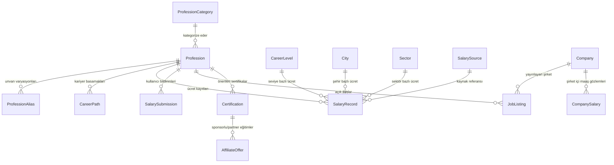

# Veritabanı Mimarisi & Veri Modeli: Türkiye Meslek & Ücret Ansiklopedisi

Bu doküman, platformun veritabanı şemasını, varlıklar (entities) arasındaki ilişkileri, ücret istatistiği hesaplama prensiplerini ve veri kaynağı sınıflandırmalarını içerir.

---

## 1. Veri Kaynağı Sınıflandırma Sistemi (Güvenilirlik Seviyeleri)

Her veri noktası mutlaka doğrulanabilir bir kaynak kodu taşımalıdır:

| Seviye | Kategori | Örnek Kaynaklar | Güven Katsayısı |
| :---: | :--- | :--- | :---: |
| **A** | **Resmi / Kurumsal Kaynak** | TÜİK, SGK, Resmi Gazete, Kamu İlanları | 0.95 |
| **B** | **Sendika / Toplu Sözleşme** | Hak-İş, Türk-İş, DİSK TİS Anlaşmaları | 0.90 |
| **C** | **Doğrulanmış İş İlanı** | Açık maaş aralığı içeren kurumsal ilanlar | 0.80 |
| **D** | **Kullanıcı Bildirimi (Doğrulanmış)** | Çift aşamalı moderasyondan geçmiş anonim saha verisi | 0.70 |
| **E** | **Araştırma / Rapor** | İK danışmanlık raporları, bağımsız anketler | 0.75 |
| **F** | **Editoryal / Piyasa Tahmini** | Veri yetersizliğinde modelleme ile türetilen tahmin | 0.50 |

---

## 2. Maaş Veri Modeli (`SalaryRecord`)

Sistem asla tekil bir "ortalama maaş" sayısına indirgenemez. Çoklu dağılım metrikleri zorunludur:

```typescript
interface SalaryRecord {
  id: string;
  professionId: string;
  careerLevelId: string;
  cityId: string | null;           // null ise Türkiye geneli
  sectorId: string | null;         // null ise tüm sektörler
  employmentType: 'FULL_TIME' | 'PART_TIME' | 'CONTRACT' | 'FREELANCE';
  experienceMin: number;           // Yıl cinsinden (örn: 0)
  experienceMax: number;           // Yıl cinsinden (örn: 2)
  
  // Dağılım İstatistikleri
  salaryMin: number;               // Gözlemlenen alt sınır
  salaryP25: number;               // 25. yüzdelik dilim
  salaryMedian: number;            // Medyan (orta değer)
  salaryP75: number;               // 75. yüzdelik dilim
  salaryMax: number;               // Gözlemlenen üst sınır
  
  currency: 'TRY' | 'USD' | 'EUR';
  grossOrNet: 'NET' | 'GROSS';
  bonusIncluded: boolean;          // Yan hak/prim dahil mi?
  
  sampleSize: number;              // Gözlem / veri noktası sayısı
  confidenceLevel: number;         // 0.00 - 1.00 arası güven skoru
  sourceGrade: 'A' | 'B' | 'C' | 'D' | 'E' | 'F';
  methodology: string;             // Örnek: "147 veri noktasından Tukey IQR filtrelemesi ile oluşturulmuştur."
  dataDate: Date;                  // Verinin ait olduğu referans dönemi
  status: 'ACTIVE' | 'ARCHIVED' | 'UNDER_REVIEW';
  createdAt: Date;
  updatedAt: Date;
}
```

---

## 3. Ana Varlıklar (Entities) & İlişkiler



### Detaylı Varlık Listesi

1. **User**: Admin, moderatör ve kayıtlı analist kullanıcıları.
2. **Profession**: Standartlaştırılmış meslek ana kaydı (örn: "Makine Mühendisi").
3. **ProfessionAlias**: Farklı adlandırmalar (örn: "Mechanical Engineer", "CAD Tasarımcısı").
4. **ProfessionCategory**: Üst kategoriler (örn: "Mühendislik & Teknoloji", "Sağlık").
5. **CareerLevel**: Junior, Mid, Senior, Lead, Manager, Director.
6. **SalaryRecord**: Birikimli istatistiksel ücret kaydı.
7. **SalaryStatistics**: Zamana yaygın trendler ve yıllık değişim oranları.
8. **SalarySource**: Resmi gazete, sendika, araştırma raporu referansı.
9. **SalarySubmission**: Kullanıcıların girdiği anonim maaş bildirimleri.
10. **Company**: Kurumlar ve şirket bilgileri.
11. **CompanySalary**: Şirket bazlı anonimleştirilmiş ücret agregasyonu.
12. **Sector**: Sektör listesi (Bilişim, Otomotiv, Perakende vb.).
13. **City**: Türkiye'nin 81 ili ve yurt dışı uzaktan seçenekleri.
14. **Certification**: Meslekle ilişkili sertifikalar (AWS, PMP, CPA vb.).
15. **Education**: Gerekli eğitim dereceleri ve bölümler.
16. **Skill**: Gerekli teknik ve sosyal yetkinlikler.
17. **CareerPath**: Meslek içi ilerleme şeması ve basamaklar arası geçiş kriterleri.
18. **JobListing**: Şirketlerden çekilen veya girilen aktif iş ilanları.
19. **Newsletter**: Bülten abone kayıtları ve Ghost entegrasyonu.
20. **AffiliateOffer**: Sertifika sayfalarındaki şeffaf eğitim ortaklıkları.
21. **DataReview**: Moderasyon kararları, moderatör notları ve onay gerekçeleri.
22. **DataChangeLog**: Herhangi bir maaş verisindeki geçmiş değişikliklerin denetim izi (audit log).
