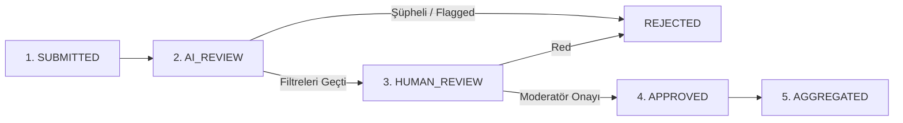

# Moderasyon & Veri Doğrulama Standardı

Bu doküman, kullanıcılar tarafından anonim olarak bildirilen maaş verilerinin incelenmesi, filtrelenmesi ve veritabanına aktarılma sürecini kapsar.

---

## 1. Moderasyon Yaşam Döngüsü

Kullanıcı tarafından paylaşılan hiçbir maaş verisi doğrudan canlı sitede yayınlanmaz.

### Durum Kodları:
- `SUBMITTED`: Kullanıcı formu doldurdu, kuyrukta bekliyor.
- `AI_REVIEW`: Otomatik filtreleme ve Gemini API PII denetimi sürecinde.
- `FLAGGED`: Şüpheli örüntü, yüksek sapma veya olası şirket ifşası içeriyor.
- `HUMAN_REVIEW`: Editoryal ekibin inceleme panelinde bekliyor.
- `APPROVED`: Onaylandı, istatistik hesaplama havuzuna dahil edildi.
- `REJECTED`: Spam, geçersiz veri veya PII ihlali nedeniyle elendi.
- `AGGREGATED`: Meslek bazlı istatistik grafikleriyle birleştirildi.

---

## 2. AI Moderatörün Denetlediği Kriterler

1. **Kişisel Veri (PII) Engelleme:**
   - T.C. Kimlik Numarası formatı (11 hane)
   - Telefon numarası (05xx, +90 formatları)
   - E-posta adresleri
   - Şahıs ad-soyad bildirimleri

2. **Şirket Sırrı & Gizlilik (NDA):**
   - Açıkça iftira niteliğindeki kurum içi dedikodular veya gizli müşteri bilgileri.

3. **Maaş Mantık & Uç Değer Kontrolü:**
   - İlgili yılın yasal asgari ücretinin altındaki tutarlar (özel part-time hariç).
   - Mesleğin ortalamasından mantıksız derecede sapan tutarlar (örn: 1 yıl deneyimli stajyere 10.000.000 TL girilmesi).

4. **Spam & Manipülasyon Engeli:**
   - Aynı IP veya parmak izinden kısa sürede çok sayıda gönderim.
   - Botlar tarafından gönderilen anlamsız metin öbekleri.

> **Önemli Kural:** AI moderasyon yalnızca ilk süzgeçtir; hiçbir veriyi tek başına kesin doğru kabul edip otomatik yayınlamaz.
