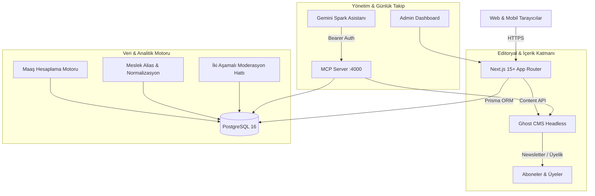

# Proje Mimarisi: Türkiye Meslek & Ücret Ansiklopedisi

Bu doküman, platformun genel sistem mimarisini, veri akışını, teknoloji yığınını ve servisler arası entegrasyon prensiplerini açıklamaktadır.

---

## 1. Mimari Genel Bakış

Platform iki ana katmandan oluşmaktadır:

---

## 2. Teknoloji Yığını

| Katman | Teknoloji | Seçim Gerekçesi |
| :--- | :--- | :--- |
| **Frontend Framework** | **Next.js (App Router, React 19)** | Hibrit SSR/SSG/ISR desteği, SEO için tam kontrol, düşük LCP/CLS. |
| **Programlama Dili** | **TypeScript** | Uçtan uca tip güvenliği, veri modellerinde sıfır çalışma zamanı sürprizi. |
| **Stil / Tasarım Sistemi** | **Tailwind CSS + Vanilla CSS Tokens** | Editorial, Financial Times & Stripe vari veri hiyerarşisi, minimal bundle boyutu. |
| **Veri Katmanı & ORM** | **PostgreSQL 16 + Prisma ORM** | İlişkisel bütünlük, güçlü JSONB filtreleme, percentile/istatistik hesaplama. |
| **Editoryal CMS** | **Ghost CMS (Headless, v5)** | Yüksek performanslı editoryal içerik, dahili bülten (newsletter), üyelik ve SEO yönetimi. |
| **Model Context Protocol** | **TypeScript MCP SDK** | Gemini Spark ile günlük durum takibi (Health, SEO, Moderasyon, İndeksleme). |
| **Bot & Spam Koruması** | **Cloudflare Turnstile** | Anonim maaş bildirimlerinde gizliliği koruyan hafif bot doğrulaması. |
| **Güvenlik & Auth** | **NextAuth / Iron Session + Argon2** | OWASP uyumlu güvenli kimlik doğrulama, rate limiting ve CSP başlıkları. |

---

## 3. Katman Sorumlulukları

### A. Editoryal Katman (Ghost CMS)
- Kariyer rehberleri, sektör analizleri, editoryal makaleler.
- Ücretsiz ve premium bültenler (Ghost Native Newsletter).
- Ghost Content API üzerinden Next.js'e Markdown / HTML aktarımı.

### B. Veri & Maaş Ansiklopedisi Katmanı (PostgreSQL + Prisma)
- Meslekler (Professions), Meslek Kategorileri, Unvan Aliasları.
- Maaş Kayıtları (`SalaryRecord`), Kaynaklar (`SalarySource`), İstatistikler (`SalaryStatistics`).
- Şehir ve sektör bazlı ücret matrisleri.
- Anonim maaş bildirimleri (`SalarySubmission`) ve moderasyon akışı.
- Sertifikalar, kariyer basamakları (`CareerPath`), iş ilanları (`JobListing`).

### C. MCP (Model Context Protocol) Katmanı
- Gemini Spark'ın platformun canlı sağlık durumunu, veri hacmini, moderasyon kuyruğunu ve indeksleme durumunu okumasını sağlar.
- Varsayılan olarak **Salt Okunur (Read-Only)** çalışır.
