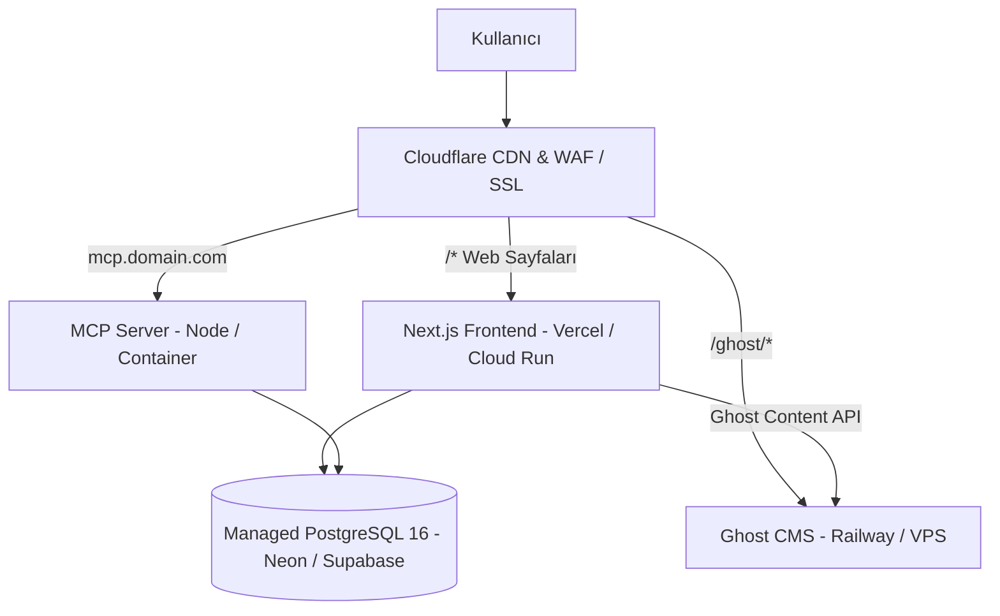

# Canlıya Dağıtım Kılavuzu (docs/DEPLOYMENT.md)

Bu doküman, sistemin üretim ortamına (production) güvenli, yüksek erişilebilirlikli ve ölçeklenebilir şekilde dağıtılması sürecini açıklar.

---

## 1. Önerilen Üretim Mimarisi

---

## 2. Ortam Değişkenleri Yönetimi
- Gerçek gizli anahtarlar asla Git'e yüklenmez.
- Vercel Dashboard / Railway Variables üzerinden şifreli olarak tanımlanır.
- `DATABASE_URL` bağlantı havuzlayıcı (connection pooler - örn. PgBouncer) üzerinden bağlanmalıdır.

---

## 3. Dağıtım Öncesi Doğrulama Adımları
1. `npm run build` hatasız tamamlanmalı.
2. `npx prisma migrate deploy` ile bekleyen veritabanı şema güncellemeleri uygulanmalı.
3. `curl -f https://domaininiz.com/api/health` uç noktası `200 OK` dönmeli.
